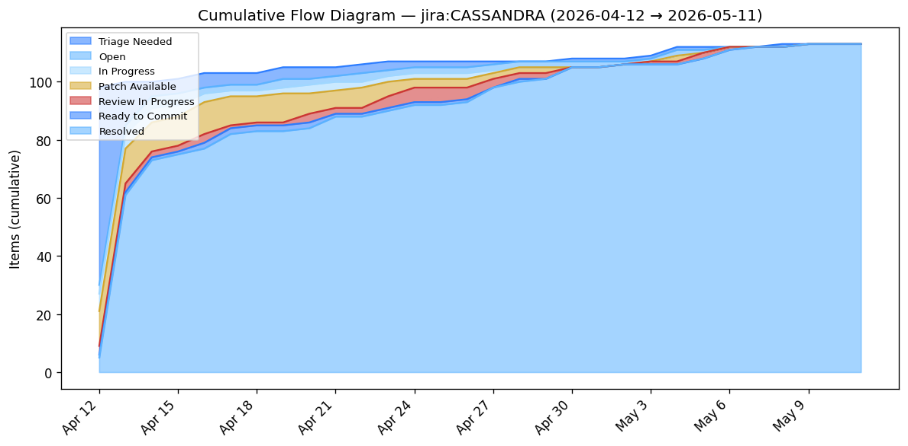

# flowmetrics

A demo-quality CLI for **Vacanti-style flow metrics and Monte Carlo
forecasting**, against GitHub PR data or Apache Jira issue data.
Every report ties back to a specific concept from Daniel Vacanti's
[*Actionable Agile Metrics*](https://leanpub.com/actionableagilemetrics)
and [*When Will It Be Done?*](https://leanpub.com/whenwillitbedone),
with inline definitions, caveats, and the bottleneck called out in
plain English.

**Live site:** <https://dvhthomas.github.io/flowmetrics/> · 
**Browse live sample reports →** <https://dvhthomas.github.io/flowmetrics/samples/>

## What it looks like

A Cumulative Flow Diagram against Apache CASSANDRA's Jira changelog —
113 issues, seven workflow states stacked by Vacanti's CFD properties:

[](https://dvhthomas.github.io/flowmetrics/samples/ASF_CASSANDRA/cfd.html)

### **[Browse all seven sample reports →](https://dvhthomas.github.io/flowmetrics/samples/)**

Seven public sources — five GitHub repos (`astral-sh/uv`,
`pytest-dev/pytest`, `huggingface/transformers`, `pre-commit/pre-commit`,
`CalcMark/go-calcmark`) and two Apache Jira projects (`CASSANDRA`,
`BIGTOP`) — each rendered as HTML, plain text, and agent-readable JSON.

---

A one-line headline for terminals and pipelines (`--format text`,
default):

```
$ uv run flow efficiency week --repo astral-sh/uv
Portfolio flow efficiency for astral-sh/uv May 5, 2026 → May 11, 2026:
8.4% across 46 completed items (31 human, 15 bot).

$ uv run flow aging --repo astral-sh/uv \
    --workflow "Draft,Awaiting Review,Changes Requested,Approved"
WIP Aging for astral-sh/uv as of May 12, 2026: 390 in-flight items,
378 already past P85 (3.2d), 368 past P95 (9.0d).
```

A schema-versioned JSON envelope (with chart data, captured logs, and
a reproducer command) for agents and dashboards (`--format json`):

```
$ uv run flow forecast when-done --repo astral-sh/uv --items 50 --format json \
    | jq '.summary'
{
  "percentiles": {"50": "2026-05-19", "70": "2026-05-21",
                  "85": "2026-05-23", "95": "2026-05-26"},
  "reading": "forward — higher confidence means a later date",
  "horizon": { "days_ahead": 11, "training_window_days": 30, "ratio": 0.37,
               "reading": "Forecast horizon is within the training window — shorter is better." }
}
```

## Five reports

- **Flow efficiency** — Portfolio FE (`Σ active / Σ cycle`) across
  merged items in a window. The system-level number, never per-engineer.
- **When-done forecast** — Monte Carlo simulation: given N items, what
  are the 50/70/85/95% confidence completion dates?
- **How-many forecast** — Given a target date, what's the minimum item
  count we can commit to at each confidence level (read **backward**)?
- **Cumulative Flow Diagram (CFD)** — Stacked workflow-state bands per
  Vacanti's six properties (arrivals on top, departures on bottom,
  vertical distance = WIP, slope = arrival rate).
- **Aging Work In Progress** — Each in-flight item plotted by current
  workflow state × age in days, with cycle-time percentile lines from
  recently completed work as risk thresholds.

## Why this exists

Most flow-metrics products implement Vacanti's toolkit partially or
with subtle distortions — a "flow efficiency" that's actually mean
per-PR, a CFD that smooths over the vertical-distance-equals-WIP
property, an Aging chart with percentile lines drawn from arbitrary
windows. This project implements the math straight from the source,
surfaces the assumptions on the rendered page itself rather than
hiding them in docs, and points back to the book wherever a number
could be misread. It's a learning artifact, not a product.

## Documentation

- **[How to install and run](docs/HOWTO.md)** — install, command
  usage, output formats, testing, regenerating samples.
- **[Metrics](docs/METRICS.md)** — how cycle / active / wait time and
  flow efficiency are computed; the clustering algorithm; assumptions.
- **[Forecasting](docs/FORECAST.md)** — Monte Carlo when-done and
  how-many, with worked examples.
- **[Decisions](docs/DECISIONS.md)** — architectural trade-offs and
  known constraints (GitHub API caps, cache strategy, WIP-tracking
  source scope).
- **[Glossary](docs/GLOSSARY.md)** — Vacanti terms, the terms we
  deliberately avoid (Scrum-contaminated "backlog" and "velocity"),
  and a concrete Portfolio-FE-vs-mean-FE worked example.
