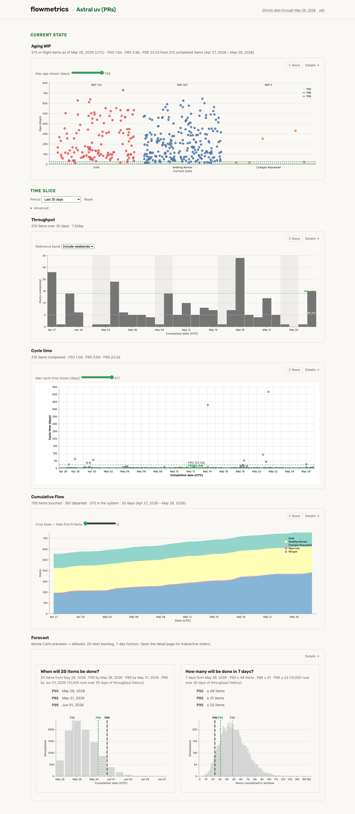
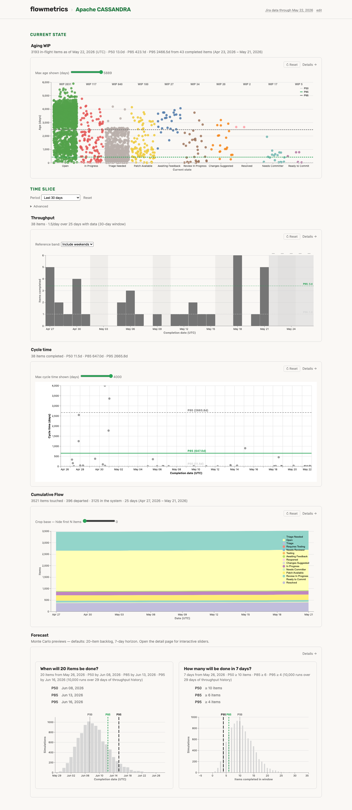

# flowmetrics

A demo-quality tool for **flow metrics and Monte Carlo forecasting**,
against GitHub (PRs and Issues) or Atlassian Jira issue data. Built on the kanban
flow-metrics framework as laid out in Daniel Vacanti's
[*Actionable Agile Metrics*](https://leanpub.com/actionableagilemetrics)
and [*When Will It Be Done?*](https://leanpub.com/whenwillitbedone) —
assumptions are surfaced on the page itself, not buried in docs.

**Live site:** <https://dvhthomas.github.io/flowmetrics/>

## What it looks like

The dashboard splits into a **Current state** snapshot (Aging WIP,
pinned to the latest data) and a **Time slice** (Throughput, Cycle
Time, CFD, Forecast — all driven by the Period picker). Same shape
for every workflow:

**GitHub — `astral-sh/uv`** (PR review cycle)

[](docs/SCREENSHOTS.md)

**Jira — Apache CASSANDRA** (richer multi-stage workflow)

[](docs/SCREENSHOTS.md)

[**More screenshots →**](docs/SCREENSHOTS.md) — per-metric detail
pages, the contract builder, and the data-source page.

[**Example workflow YAMLs →**](samples/) — copy-paste starters for
GitHub PR cycles, label-driven workflows, and Atlassian Jira projects.

## Install

```bash
# 1. Install uv (Python toolchain). macOS / Linux / Windows one-liners
#    at https://docs.astral.sh/uv/.
brew install uv                                  # macOS
# curl -LsSf https://astral.sh/uv/install.sh | sh   # Linux
# irm https://astral.sh/uv/install.ps1 | iex        # Windows PowerShell

# 2. Install flowmetrics as a global tool (isolated env, exposes `flow`).
uv tool install git+https://github.com/dvhthomas/flowmetrics

# 3. Smoke-test.
flow --help
```

Full walkthrough: **[Tutorial](docs/TUTORIAL.md)** — zero to dashboard
in five minutes.

## Two ways to use it

**Interactive dashboard** — start the server, configure workflows in
the browser, browse charts. The wizard probes your GitHub repo or
Jira project, suggests stages, and writes a `workflows.db` — no
hand-edited YAML needed.

```
flow serve              # → http://127.0.0.1:8000 → "+ New workflow"
# macOS + Linux: `flow serve --bg` installs a persistent native
# service (launchd / systemd-user) so the dashboard survives
# logout and reboot.
```

**Metric extraction for agents** — graphics-free text + JSON output
for pipelines and headless analysis. Each command points at a
configured workflow (`--workflow-name`) or a YAML file
(`--workflow-yaml`).

```
$ flow metric cycle-time --workflow-name astral-uv \
    --start 2026-05-04 --stop 2026-05-10
astral-uv (astral-sh/uv) 2026-05-04 → 2026-05-10: 46 completed items;
P50=1.2d, P85=3.4d, P95=7.1d.

$ flow forecast date --workflow-name astral-uv --items 50 --format json \
    | jq '.summary.percentiles'
{"50": "2026-05-19", "70": "2026-05-21", "85": "2026-05-23", "95": "2026-05-26"}
```

## What you get

- **Cycle Time** — per-item cycle times with empirical P50/P85/P95.
- **Throughput** — daily completion counts with an empirical P50/P85
  reference band.
- **Cumulative Flow Diagram** — the six standard CFD properties laid out
  honestly: arrivals on top, departures on bottom, vertical distance =
  WIP, slope = arrival rate.
- **Aging WIP** — every in-flight item plotted by current workflow state
  × age (CD − SD + 1), with completed-item percentile lines as risk
  thresholds.
- **Forecasts** — Monte Carlo `flow forecast date` (date for N items)
  and `flow forecast throughput` (items by target date) at
  50/70/85/95% confidence.

## Why this exists

Most flow-metrics products implement the kanban-flow toolkit partially
or with subtle distortions — a CFD that smooths over the
vertical-distance-equals-WIP property, an Aging chart with percentile
lines drawn from arbitrary windows. This project implements the math
honestly, surfaces the
assumptions on the rendered page itself rather than hiding them in
docs, and links out to the canonical references where a number could
be misread. It's a learning artifact, not a product.

## Documentation

Organised by [Diátaxis](https://diataxis.fr/): a tutorial to learn
from, how-to guides for specific tasks, reference for canonical
facts, plus background explainers.

**Get started**

- **[Tutorial](docs/TUTORIAL.md)** — zero to dashboard in five
  minutes. Install, write a YAML, materialize, serve.

**Task-specific guides**

- **[How-to guides](docs/HOWTO.md)** — install on each OS, schedule
  fetches, run as a persistent web server, back up + restore (data /
  config / both), Docker, ad-hoc reports, JSON for agents,
  troubleshooting.

**Reference**

- **[CLI + YAML + file layout](docs/REFERENCE.md)** — every command,
  every flag, every file. Output envelope schemas.
- **[Forecasting](docs/FORECAST.md)** — Monte Carlo `forecast date`
  and `forecast throughput`, with worked examples.
- **[Glossary](docs/GLOSSARY.md)** — terms and definitions; the terms
  we deliberately avoid (Scrum-contaminated "backlog" and "velocity").

**Explanation**

- **[Decisions](docs/DECISIONS.md)** — architectural trade-offs and
  known constraints (GitHub API caps, cache strategy, WIP-tracking
  source scope).
- **[Screenshots](docs/SCREENSHOTS.md)** — every page, both source
  types (GitHub PRs + Atlassian Jira), captured against live data.
