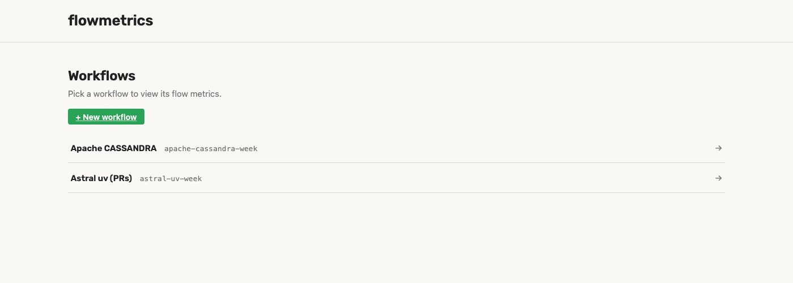
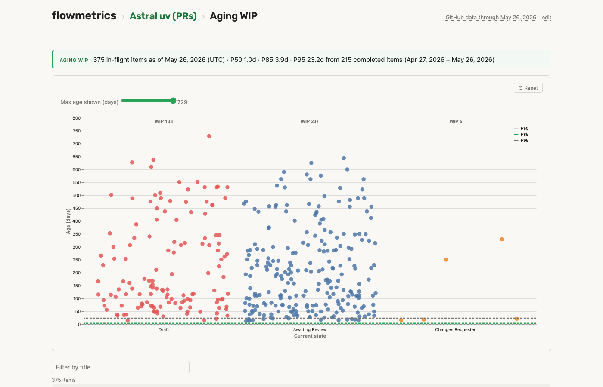
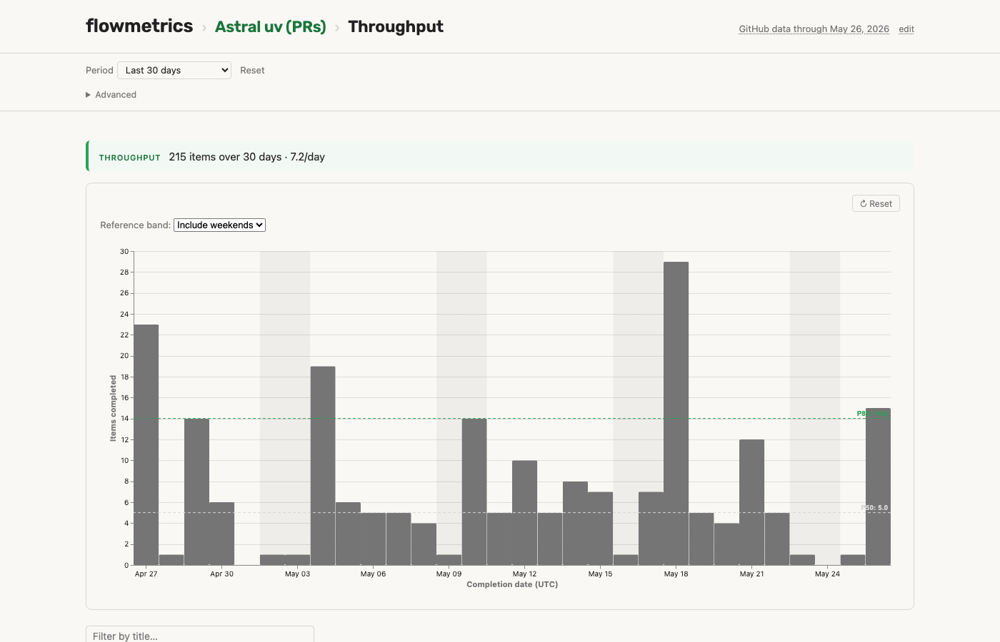
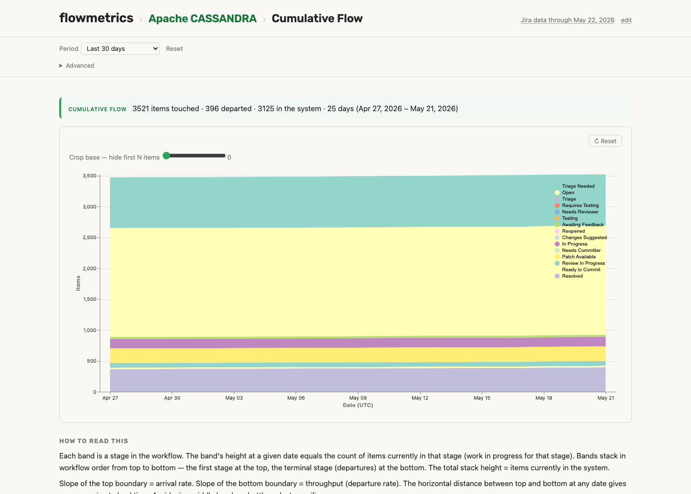
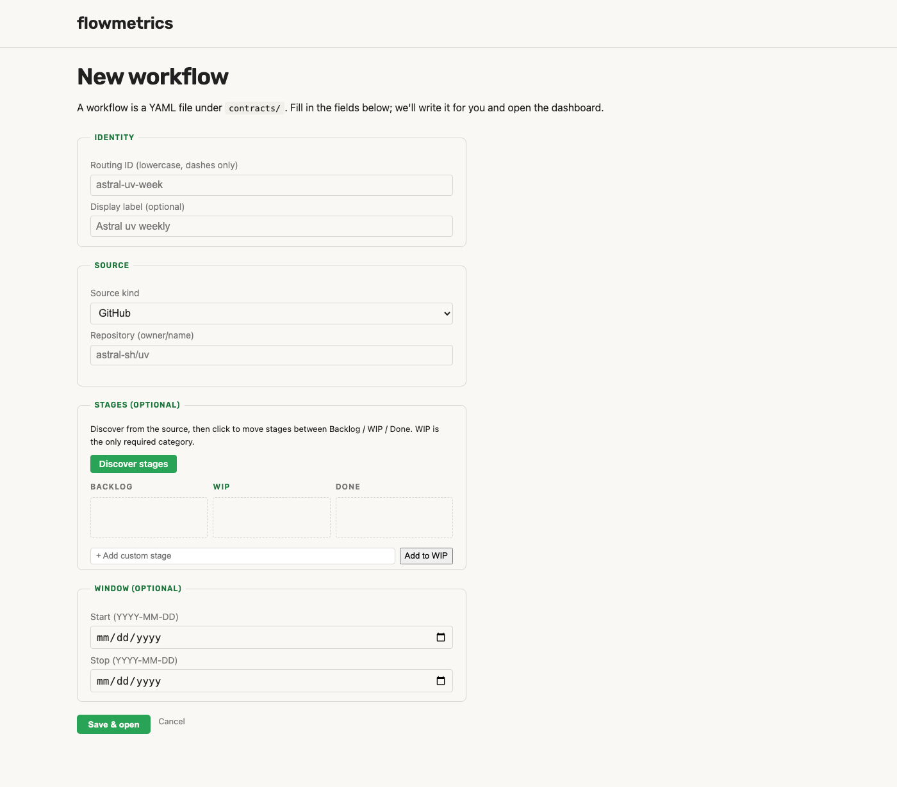

# Screenshots

Live captures of the dashboard against two public data sources — a
GitHub repo (`astral-sh/uv`) and an Atlassian Jira project on Apache's
public instance (`CASSANDRA`).
Every chart and control on every page; nothing is mocked.

## Home — workflow picker

The landing page lists every contract YAML under `--workflows-dir`.
"+ New workflow" opens the contract builder.



## GitHub source — `astral-sh/uv`

Full dashboard. **Current state** holds Aging WIP, pinned to the most
recent materialise. **Time slice** holds Throughput, Cycle Time,
Cumulative Flow, and Forecast — all driven by the Period picker
(`Last 7 days`, `Last 30 days`, …).


### Aging WIP — detail

In-flight items plotted by current workflow state (`Draft`,
`Awaiting Review`, …) × age in days. Dashed reference lines are
empirical percentiles (P50, P85, P95) drawn from completed-item cycle
times.



### Throughput — detail

Daily completion counts as bars. The dashed horizontal rules are an
empirical P50 / P85 reference band; the dropdown above the chart
toggles between an "Include weekends" sample and a "Weekdays only"
sample (both pre-computed).



## Jira source — Apache CASSANDRA

The same dashboard shape against a Jira data source — different
workflow states (`Triage Needed`, `In Progress`, `Patch Available`,
`Review In Progress`, `Ready to Commit`, `Resolved`, `Closed`), same
math.


### Cumulative Flow — detail

Stacked-band Cumulative Flow Diagram. Band height = items currently in
that stage; total stack height = items currently in the system; slope
of the top = arrival rate; slope of the bottom = throughput.



## Contract builder

`/admin/contracts/new` builds a workflow YAML through a structured
form. Source picker (GitHub or Jira), repo / project validator that
pings the source API to confirm the target exists, and a stage builder
that discovers known stages from the warehouse and lets the user move
them between backlog / WIP / done buckets.



## How these were captured

Every screenshot here is a headless-Playwright snapshot of the live
dashboard at `http://127.0.0.1:8000`, run against the warehouse
populated by:

```
flow materialise astral-uv-week        # GitHub PR cycle
flow materialise apache-cassandra-week  # Jira changelog
flow serve --workflows-dir contracts/ --data-dir data/
```

The contract YAMLs used are the copy-paste starters in
[`samples/`](../samples/). Run `bash docs/regen-screenshots.sh` to
regenerate the whole set from your local server.
